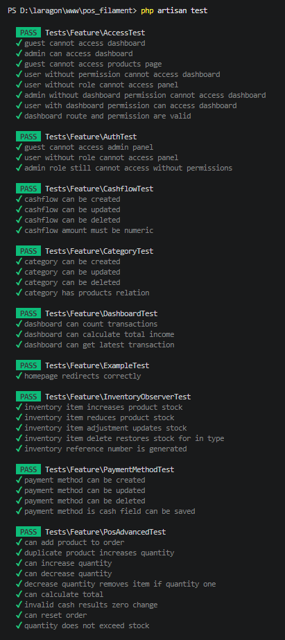
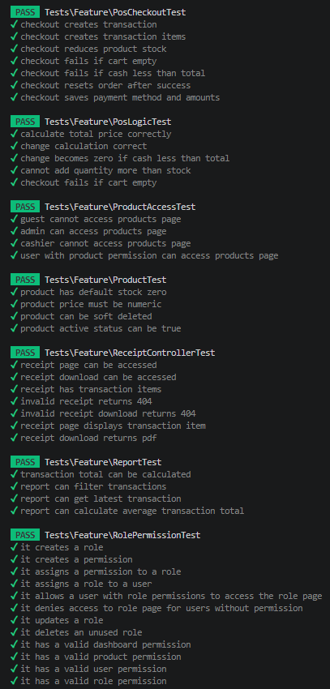
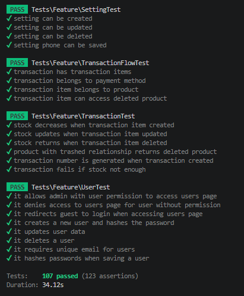

# Lampiran Pengujian White Box Sistem POS Filament

---

## Keterangan Revisi

Pengujian white box pada sistem POS Filament dilakukan untuk memastikan setiap proses utama pada sistem berjalan sesuai skenario yang telah ditentukan. Pengujian dilakukan terhadap 13 fitur utama sistem POS, yaitu Login/Auth, Dashboard, POS/Kasir, Produk, Kategori, Inventory, Transaksi, Cash Flow, Payment Method, Report, User Management, Role/Permission, dan Setting.

---

# Tabel 4. Hasil Pengujian White Box Fitur Login / Auth

| No | Input | Process | Output | Result |
| -- | ----- | ------- | ------ | ------ |
| 1 | Guest mengakses admin panel | Menguji proteksi akses panel untuk guest | Guest diarahkan ke halaman login | Valid |
| 2 | User tanpa role mengakses panel | Menguji validasi akses user tanpa role | User tidak dapat mengakses panel | Valid |
| 3 | Admin role tanpa permission mengakses panel | Menguji validasi permission awal pada panel | Akses panel ditolak | Valid |

### Evidence Pengujian

* File test:

  * `tests/Feature/AuthTest.php`
  * `tests/Feature/AccessTest.php`

* File terkait:

  * `app/Models/User.php`
  * `app/Providers/Filament/AdminPanelProvider.php`
  * File konfigurasi autentikasi panel Filament

---

# Tabel 5. Hasil Pengujian White Box Fitur Dashboard

| No | Input | Process | Output | Result |
| -- | ----- | ------- | ------ | ------ |
| 1 | Data transaksi tersedia | Menguji perhitungan jumlah transaksi dashboard | Jumlah transaksi berhasil ditampilkan | Valid |
| 2 | Data income tersedia | Menguji perhitungan total income | Total income berhasil ditampilkan | Valid |
| 3 | Data transaksi terbaru tersedia | Menguji pengambilan latest transaction | Transaksi terbaru berhasil ditampilkan | Valid |
| 4 | Admin mengakses dashboard | Menguji akses dashboard untuk admin | Dashboard berhasil diakses | Valid |
| 5 | Guest mengakses dashboard | Menguji proteksi dashboard untuk guest | Guest diarahkan ke login | Valid |
| 6 | User tanpa permission mengakses dashboard | Menguji pembatasan akses dashboard | Akses dashboard ditolak | Valid |
| 7 | User dengan permission dashboard | Menguji akses dashboard berdasarkan permission | Dashboard berhasil diakses | Valid |
| 8 | Route dashboard diakses | Menguji validasi route dashboard | Route dashboard berjalan sesuai konfigurasi | Valid |
| 9 | Permission dashboard diperiksa | Menguji validasi permission dashboard | Permission dashboard berhasil dikenali | Valid |

### Evidence Pengujian

* File test:

  * `tests/Feature/DashboardTest.php`
  * `tests/Feature/AccessTest.php`
  * `tests/Feature/RolePermissionTest.php`

* File terkait:

  * File dashboard/page Filament
  * File widget dashboard Filament
  * `app/Models/Transaction.php`
  * `app/Models/User.php`

### Catatan

Pada sistem Filament, pengujian statistik dashboard tidak menggunakan file `AggregateQueryTest.php`. Pengujian statistik dashboard dicakup melalui `DashboardTest.php`.

---

# Tabel 6. Hasil Pengujian White Box Fitur Kasir / POS

| No | Input | Process | Output | Result |
| -- | ----- | ------- | ------ | ------ |
| 1 | Produk ditambahkan ke order | Menguji add product to order | Produk berhasil masuk ke order | Valid |
| 2 | Produk yang sama ditambahkan kembali | Menguji duplicate product handling | Quantity produk bertambah | Valid |
| 3 | User menambah quantity item | Menguji increase quantity | Quantity item bertambah | Valid |
| 4 | User mengurangi quantity item | Menguji decrease quantity | Quantity item berkurang | Valid |
| 5 | Quantity item bernilai satu lalu dikurangi | Menguji remove item ketika quantity satu | Item berhasil dihapus dari order | Valid |
| 6 | Data order tersedia | Menguji calculate total | Total order berhasil dihitung | Valid |
| 7 | Nominal bayar lebih besar dari total | Menguji calculate change | Kembalian berhasil dihitung | Valid |
| 8 | Nominal bayar tidak valid | Menguji invalid cash change | Kembalian menjadi 0 | Valid |
| 9 | User melakukan reset order | Menguji reset order | Order berhasil dikosongkan | Valid |
| 10 | Quantity melebihi stok | Menguji validasi quantity terhadap stok | Quantity tidak dapat melebihi stok | Valid |
| 11 | Checkout dengan data valid | Menguji create checkout transaction | Transaksi berhasil dibuat | Valid |
| 12 | Checkout dengan item transaksi | Menguji create transaction items | Item transaksi berhasil dibuat | Valid |
| 13 | Checkout berhasil | Menguji pengurangan stok produk | Stok produk berhasil berkurang | Valid |
| 14 | Checkout tanpa item | Menguji validasi cart kosong | Checkout gagal diproses | Valid |
| 15 | Pembayaran kurang dari total | Menguji validasi pembayaran | Checkout gagal diproses | Valid |
| 16 | Checkout berhasil | Menguji reset order setelah transaksi | Order berhasil dikosongkan | Valid |
| 17 | Metode pembayaran dipilih | Menguji penyimpanan payment method | Metode pembayaran tersimpan | Valid |
| 18 | Nominal pembayaran dimasukkan | Menguji penyimpanan payment amount | Nominal pembayaran tersimpan | Valid |
| 19 | Data harga tersedia | Menguji total price calculation | Total harga sesuai | Valid |
| 20 | Cart kosong pada logic POS | Menguji validasi cart kosong pada business logic | Proses transaksi ditolak | Valid |

### Evidence Pengujian

* File test:

  * `tests/Feature/PosCheckoutTest.php`
  * `tests/Feature/PosLogicTest.php`
  * `tests/Feature/PosAdvancedTest.php`

* File terkait:

  * File page POS/Kasir Filament
  * `app/Models/Transaction.php`
  * `app/Models/TransactionItem.php`
  * `app/Models/Product.php`
  * `app/Models/PaymentMethod.php`

---

# Tabel 7. Hasil Pengujian White Box Fitur Produk

| No | Input | Process | Output | Result |
| -- | ----- | ------- | ------ | ------ |
| 1 | Guest mengakses halaman produk | Menguji akses halaman produk untuk guest | Guest diarahkan ke login | Valid |
| 2 | Admin mengakses halaman produk | Menguji akses produk untuk admin | Halaman produk berhasil diakses | Valid |
| 3 | Cashier mengakses halaman produk | Menguji akses produk berdasarkan role | Akses diproses sesuai permission | Valid |
| 4 | User tanpa permission produk | Menguji pembatasan akses produk | Akses produk ditolak | Valid |
| 5 | Input produk tanpa stok | Menguji default stock produk | Nilai stok menjadi 0 | Valid |
| 6 | Input harga tidak numeric | Menguji validasi harga numeric | Validasi gagal diproses | Valid |
| 7 | Input delete produk | Menguji soft delete produk | Produk berhasil dihapus secara soft delete | Valid |
| 8 | Input status produk aktif | Menguji status aktif produk | Status aktif berhasil disimpan | Valid |
| 9 | Data produk diakses | Menguji validasi data produk | Data produk berhasil diproses | Valid |

### Evidence Pengujian

* File test:

  * `tests/Feature/ProductTest.php`
  * `tests/Feature/ProductAccessTest.php`

* File terkait:

  * File resource produk Filament
  * `app/Models/Product.php`
  * `app/Models/Category.php`

---

# Tabel 8. Hasil Pengujian White Box Fitur Kategori

| No | Input | Process | Output | Result |
| -- | ----- | ------- | ------ | ------ |
| 1 | Input kategori baru | Menguji create kategori melalui resource Filament | Kategori berhasil disimpan | Valid |
| 2 | Input update kategori | Menguji update kategori | Kategori berhasil diperbarui | Valid |
| 3 | Input delete kategori | Menguji delete kategori | Kategori berhasil dihapus | Valid |
| 4 | Data produk pada kategori | Menguji relasi kategori dengan produk | Relasi kategori dan produk berhasil digunakan | Valid |

### Evidence Pengujian

* File test:

  * `tests/Feature/CategoryTest.php`
  * `tests/Feature/ProductTest.php`

* File terkait:

  * File resource kategori Filament
  * `app/Models/Category.php`
  * `app/Models/Product.php`

### Catatan

Pada sistem Filament, pengujian relasi kategori dan produk tidak menggunakan file khusus `RelationshipTest.php`. Relasi data dibaca dari pengujian modul kategori dan produk.

---

# Tabel 9. Hasil Pengujian White Box Fitur Inventory

| No | Input | Process | Output | Result |
| -- | ----- | ------- | ------ | ------ |
| 1 | Inventory item tipe masuk | Menguji penambahan stok produk | Stok produk bertambah | Valid |
| 2 | Inventory item tipe keluar | Menguji pengurangan stok produk | Stok produk berkurang | Valid |
| 3 | Inventory item adjustment | Menguji penyesuaian stok | Stok berhasil disesuaikan | Valid |
| 4 | Inventory item dihapus | Menguji pengembalian stok setelah delete | Stok berhasil dikembalikan | Valid |
| 5 | Data inventory dibuat | Menguji pembuatan nomor referensi inventory | Nomor referensi inventory berhasil dibuat | Valid |

### Evidence Pengujian

* File test:

  * `tests/Feature/InventoryObserverTest.php`

* File terkait:

  * File resource inventory Filament
  * File observer inventory
  * `app/Models/Product.php`
  * `app/Models/Inventory.php`

### Catatan

Pada sistem Filament, pengujian inventory menekankan penggunaan observer untuk menjaga konsistensi perubahan stock.

---

# Tabel 10. Hasil Pengujian White Box Fitur Transaksi

| No | Input | Process | Output | Result |
| -- | ----- | ------- | ------ | ------ |
| 1 | Data transaksi tersedia | Menguji relasi transaksi dengan item transaksi | Transaction items berhasil diambil | Valid |
| 2 | Data payment method tersedia | Menguji relasi transaksi dengan payment method | Payment method berhasil diambil | Valid |
| 3 | Data produk tersedia | Menguji relasi transaction item dengan produk | Produk berhasil diambil | Valid |
| 4 | Produk sudah dihapus | Menguji akses deleted product pada transaksi | Produk yang terhapus tetap dapat dibaca pada transaksi | Valid |
| 5 | Transaction item dibuat | Menguji pengurangan stok saat item transaksi dibuat | Stok produk berkurang | Valid |
| 6 | Transaction item diperbarui | Menguji sinkronisasi stok saat item transaksi diperbarui | Stok produk berubah sesuai transaksi | Valid |
| 7 | Transaction item dihapus | Menguji pengembalian stok saat item transaksi dihapus | Stok produk kembali | Valid |
| 8 | Produk relasi terhapus | Menguji pembacaan deleted product relation | Relasi produk terhapus tetap terbaca | Valid |
| 9 | Data transaksi dibuat | Menguji pembuatan nomor transaksi otomatis | Nomor transaksi berhasil dibuat otomatis | Valid |
| 10 | Stok tidak mencukupi | Menguji validasi stok pada transaksi | Transaksi gagal diproses | Valid |
| 11 | User membuka receipt transaksi | Menguji akses halaman receipt sebagai bagian dari transaksi | Receipt transaksi berhasil diakses | Valid |
| 12 | User mengakses alur receipt transaksi | Menguji receipt flow pada transaksi | Receipt berhasil diproses sebagai bagian dari transaksi | Valid |

### Evidence Pengujian

* File test:

  * `tests/Feature/TransactionTest.php`
  * `tests/Feature/TransactionFlowTest.php`
  * `tests/Feature/ReceiptControllerTest.php`

* File terkait:

  * File resource transaksi Filament
  * File controller receipt/struk
  * `app/Models/Transaction.php`
  * `app/Models/TransactionItem.php`
  * `app/Models/Product.php`
  * `app/Models/PaymentMethod.php`
  * `app/Models/CashboxFlow.php`

### Catatan

`ReceiptControllerTest.php` tidak dipisahkan menjadi fitur utama tersendiri, tetapi digabungkan ke fitur Transaksi karena receipt/struk merupakan bagian dari alur transaksi.

---

# Tabel 11. Hasil Pengujian White Box Fitur Cash Flow

| No | Input | Process | Output | Result |
| -- | ----- | ------- | ------ | ------ |
| 1 | Input create cashflow | Menguji create cashflow | Data cashflow berhasil disimpan | Valid |
| 2 | Input update cashflow | Menguji update cashflow | Data cashflow berhasil diperbarui | Valid |
| 3 | Input delete cashflow | Menguji delete cashflow | Data cashflow berhasil dihapus | Valid |
| 4 | Input nominal tidak valid | Menguji validasi nominal cashflow | Validasi gagal diproses | Valid |

### Evidence Pengujian

* File test:

  * `tests/Feature/CashflowTest.php`

* File terkait:

  * File resource cash flow Filament
  * `app/Models/CashboxFlow.php`
  * `app/Models/Transaction.php`

---

# Tabel 12. Hasil Pengujian White Box Fitur Payment Method

| No | Input | Process | Output | Result |
| -- | ----- | ------- | ------ | ------ |
| 1 | Input create payment method | Menguji create payment method melalui resource Filament | Data berhasil disimpan | Valid |
| 2 | Input update payment method | Menguji update payment method | Data berhasil diperbarui | Valid |
| 3 | Input delete payment method | Menguji delete payment method | Data berhasil dihapus | Valid |
| 4 | Input field `is_cash` | Menguji penyimpanan field `is_cash` pada metode pembayaran | Status cash berhasil disimpan | Valid |

### Evidence Pengujian

* File test:

  * `tests/Feature/PaymentMethodTest.php`

* File terkait:

  * File resource payment method Filament
  * `app/Models/PaymentMethod.php`
  * `app/Models/Transaction.php`

---

# Tabel 13. Hasil Pengujian White Box Fitur Report

| No | Input | Process | Output | Result |
| -- | ----- | ------- | ------ | ------ |
| 1 | Input transaksi | Menguji perhitungan total transaksi pada laporan | Total transaksi berhasil dihitung | Valid |
| 2 | Input filter transaksi | Menguji filter transaksi pada laporan | Data laporan berhasil difilter | Valid |
| 3 | Input latest transaction | Menguji pengambilan transaksi terbaru | Transaksi terbaru berhasil diambil | Valid |
| 4 | Data total transaksi tersedia | Menguji perhitungan rata-rata total transaksi | Rata-rata transaksi berhasil dihitung | Valid |

### Evidence Pengujian

* File test:

  * `tests/Feature/ReportTest.php`

* File terkait:

  * File page/report Filament
  * `app/Models/Transaction.php`
  * `app/Models/TransactionItem.php`
  * `app/Models/CashboxFlow.php`

### Catatan

Pada sistem Filament, pengujian laporan tidak menggunakan file `AggregateQueryTest.php`. Pengujian statistik dan ringkasan laporan dicakup melalui `ReportTest.php`.

---

# Tabel 14. Hasil Pengujian White Box Fitur User Management

| No | Input | Process | Output | Result |
| -- | ----- | ------- | ------ | ------ |
| 1 | Admin dengan permission user | Menguji akses halaman user | Halaman user berhasil diakses | Valid |
| 2 | User tanpa permission | Menguji pembatasan akses halaman user | Akses halaman user ditolak | Valid |
| 3 | Guest mengakses halaman user | Menguji proteksi authentication user page | Guest diarahkan ke login | Valid |
| 4 | Input user baru | Menguji create user | User berhasil disimpan | Valid |
| 5 | Input password user | Menguji password hashing | Password tersimpan dalam bentuk hash | Valid |
| 6 | Input perubahan data user | Menguji update user | Data user berhasil diperbarui | Valid |
| 7 | Input delete user | Menguji delete user | User berhasil dihapus | Valid |
| 8 | Input email duplikat | Menguji validasi unique email | Validasi gagal diproses | Valid |

### Evidence Pengujian

* File test:

  * `tests/Feature/UserTest.php`
  * `tests/Feature/AuthTest.php`

* File terkait:

  * File resource user Filament
  * `app/Models/User.php`

---

# Tabel 15. Hasil Pengujian White Box Fitur Role / Permission

| No | Input | Process | Output | Result |
| -- | ----- | ------- | ------ | ------ |
| 1 | Input role baru | Menguji create role | Role berhasil disimpan | Valid |
| 2 | Input permission baru | Menguji create permission | Permission berhasil dibuat | Valid |
| 3 | Input permission pada role | Menguji assign permission to role | Permission berhasil tersimpan pada role | Valid |
| 4 | Input role pada user | Menguji assign role to user | Role berhasil diberikan ke user | Valid |
| 5 | User dengan permission role | Menguji akses halaman role | Halaman role berhasil diakses | Valid |
| 6 | User tanpa permission role | Menguji pembatasan akses halaman role | Akses halaman role ditolak | Valid |
| 7 | Input update role | Menguji update role | Role berhasil diperbarui | Valid |
| 8 | Input delete unused role | Menguji delete role yang tidak digunakan | Role berhasil dihapus | Valid |
| 9 | Permission dashboard | Menguji validasi permission dashboard | Permission dashboard berhasil dikenali | Valid |
| 10 | Permission produk | Menguji validasi permission produk | Permission produk berhasil dikenali | Valid |
| 11 | Permission user | Menguji validasi permission user | Permission user berhasil dikenali | Valid |
| 12 | Permission role | Menguji validasi permission role | Permission role berhasil dikenali | Valid |

### Evidence Pengujian

* File test:

  * `tests/Feature/RolePermissionTest.php`
  * `tests/Feature/AccessTest.php`

* File terkait:

  * File resource role/permission Filament
  * `app/Models/User.php`
  * Model/konfigurasi role dan permission yang digunakan pada sistem

---

# Tabel 16. Hasil Pengujian White Box Fitur Setting

| No | Input | Process | Output | Result |
| -- | ----- | ------- | ------ | ------ |
| 1 | Input create setting | Menguji create setting | Setting berhasil disimpan | Valid |
| 2 | Input update setting | Menguji update setting | Setting berhasil diperbarui | Valid |
| 3 | Input delete setting | Menguji delete setting | Setting berhasil dihapus | Valid |
| 4 | Input nomor telepon | Menguji penyimpanan phone number | Nomor telepon berhasil disimpan | Valid |

### Evidence Pengujian

* File test:

  * `tests/Feature/SettingTest.php`

* File terkait:

  * File page/resource setting Filament
  * `app/Models/Setting.php`

---

# Rekapitulasi Hasil Pengujian White Box

| No | Modul Utama | Jumlah Test Case | Berhasil | Gagal | Persentase |
| -- | ----------- | ---------------- | -------- | ----- | ---------- |
| 1 | Dashboard | 9 | 9 | 0 | 100% |
| 2 | POS / Kasir | 20 | 20 | 0 | 100% |
| 3 | Produk | 9 | 9 | 0 | 100% |
| 4 | Kategori | 4 | 4 | 0 | 100% |
| 5 | Inventory | 5 | 5 | 0 | 100% |
| 6 | Transaksi | 12 | 12 | 0 | 100% |
| 7 | Payment Method | 4 | 4 | 0 | 100% |
| 8 | Cash Flow | 4 | 4 | 0 | 100% |
| 9 | Report | 4 | 4 | 0 | 100% |
| 10 | User Management | 8 | 8 | 0 | 100% |
| 11 | Role / Permission | 12 | 12 | 0 | 100% |
| 12 | Setting | 4 | 4 | 0 | 100% |
| 13 | Login / Auth | 3 | 3 | 0 | 100% |
| | **TOTAL** | **98** | **98** | **0** | **100%** |

---

# Hasil Testing dengan PHPUnit

Berdasarkan hasil eksekusi PHPUnit terbaru, seluruh pengujian pada sistem POS Filament berhasil dijalankan tanpa test yang gagal.

| Aspek | Hasil |
| ----- | ----- |
| Command | `php artisan test` |
| Total Test Case Pembanding | 98 test case |
| Total Berhasil | 98 test case |
| Total Gagal | 0 test case |
| Persentase Keberhasilan | 100% |
| Status | Passed |

### Catatan Hasil PHPUnit

Output PHPUnit mentah pada sistem Filament menunjukkan jumlah test yang lebih besar daripada rekapitulasi skenario pembanding. Hal ini karena terdapat test tambahan seperti `ExampleTest.php` serta pengujian receipt/struk yang secara teknis berada pada `ReceiptControllerTest.php`. Dalam rekapitulasi 13 fitur utama, `ExampleTest.php` tidak dihitung karena bukan fitur operasional sistem POS, sedangkan receipt/struk digabungkan ke fitur Transaksi.

---

# Ringkasan Cakupan Pengujian

| Komponen Utama | Status Pengujian | Evidence File Testing |
| -------------- | ---------------- | --------------------- |
| User Permission | Berhasil diuji | `RolePermissionTest.php`, `AccessTest.php` |
| Authentication | Berhasil diuji | `AuthTest.php`, `AccessTest.php` |
| Access Control | Berhasil diuji | `AccessTest.php`, `RolePermissionTest.php` |
| POS Logic | Berhasil diuji | `PosLogicTest.php`, `PosCheckoutTest.php`, `PosAdvancedTest.php` |
| Transaction Logic | Berhasil diuji | `TransactionTest.php`, `TransactionFlowTest.php` |
| Product CRUD | Berhasil diuji | `ProductTest.php`, `ProductAccessTest.php` |
| Category CRUD | Berhasil diuji | `CategoryTest.php` |
| Inventory Flow / Observer | Berhasil diuji | `InventoryObserverTest.php` |
| Payment Method | Berhasil diuji | `PaymentMethodTest.php` |
| Cash Flow | Berhasil diuji | `CashflowTest.php` |
| Relasi Data Modul | Berhasil diuji | `TransactionTest.php`, `TransactionFlowTest.php`, `CategoryTest.php`, `ProductTest.php` |
| Dashboard dan Statistik | Berhasil diuji | `DashboardTest.php` |
| Report | Berhasil diuji | `ReportTest.php` |
| Setting | Berhasil diuji | `SettingTest.php` |
| Receipt / Struk | Berhasil diuji sebagai bagian dari Transaksi | `ReceiptControllerTest.php` |

---

# Daftar File Testing

| No | File Testing |
| -- | ------------ |
| 1 | `AccessTest.php` |
| 2 | `AuthTest.php` |
| 3 | `CashflowTest.php` |
| 4 | `CategoryTest.php` |
| 5 | `DashboardTest.php` |
| 6 | `ExampleTest.php` |
| 7 | `InventoryObserverTest.php` |
| 8 | `PaymentMethodTest.php` |
| 9 | `PosAdvancedTest.php` |
| 10 | `PosCheckoutTest.php` |
| 11 | `PosLogicTest.php` |
| 12 | `ProductAccessTest.php` |
| 13 | `ProductTest.php` |
| 14 | `ReceiptControllerTest.php` |
| 15 | `ReportTest.php` |
| 16 | `RolePermissionTest.php` |
| 17 | `SettingTest.php` |
| 18 | `TransactionFlowTest.php` |
| 19 | `TransactionTest.php` |
| 20 | `UserTest.php` |

---

# Catatan Penggantian Istilah Pengujian

Pada laporan Filament, istilah **Relationship Testing** tidak digunakan sebagai komponen file test khusus karena tidak terdapat file `RelationshipTest.php` pada daftar file testing Filament. Cakupan relasi data tetap diuji, tetapi berada di dalam pengujian modul yang berkaitan langsung dengan relasi data, seperti transaksi, alur transaksi, kategori, produk, dan metode pembayaran.

Selain itu, istilah **Aggregate Query** juga tidak digunakan sebagai file test khusus karena tidak terdapat file `AggregateQueryTest.php` pada daftar file testing Filament. Pengujian statistik dashboard dan laporan dicakup melalui `DashboardTest.php` dan `ReportTest.php`.

Dengan demikian, penulisan cakupan pengujian Filament yang lebih tepat adalah **Relasi Data Modul**, **Dashboard dan Statistik**, serta **Report**, bukan `RelationshipTest.php` dan `AggregateQueryTest.php`.

---

# Analisis Hasil Pengujian White Box Filament

Berdasarkan hasil pengujian white box, sistem POS berbasis Filament memperoleh tingkat keberhasilan sebesar 100%. Seluruh skenario pembanding yang diuji pada 13 modul utama memperoleh status valid. Modul yang diuji meliputi Dashboard, POS/Kasir, Produk, Kategori, Inventory, Transaksi, Cash Flow, Payment Method, Report, User Management, Role/Permission, Setting, dan Login/Auth.

Keberhasilan pengujian tersebut menunjukkan bahwa proses utama pada sistem POS Filament telah berjalan sesuai skenario yang ditentukan. Fitur dashboard berhasil menampilkan statistik utama seperti jumlah transaksi, total income, dan transaksi terbaru. Fitur POS berhasil menangani order, quantity, total, kembalian, checkout, validasi stok, validasi pembayaran, dan validasi cart.

Pada fitur inventory, pengujian menunjukkan bahwa proses perubahan stok dapat dikendalikan melalui observer. Hal ini membantu menjaga konsistensi stok ketika terjadi penambahan, pengurangan, penyesuaian, maupun penghapusan data inventory. Pada fitur transaksi, pengujian menunjukkan bahwa data transaksi, item transaksi, produk, metode pembayaran, stok, receipt, dan cashflow dapat berjalan secara terintegrasi.

Fitur Cash Flow berhasil diuji untuk create, update, delete, dan validasi nominal. Fitur Payment Method, Report, User Management, Role/Permission, Setting, dan Login/Auth juga memperoleh hasil valid sesuai skenario masing-masing. Dengan demikian, seluruh fitur utama yang digunakan dalam perbandingan berhasil diuji tanpa kegagalan.

---

# Kesimpulan Hasil Pengujian White Box Filament

Berdasarkan hasil pengujian white box pada sistem POS Filament, seluruh fitur utama telah diuji dan memperoleh status valid. Total skenario pembanding yang diuji berjumlah **98 test case**, dengan **98 test case berhasil**, **0 test case gagal**, dan persentase keberhasilan sebesar **100%**.

Dengan demikian, sistem POS Filament dapat dinyatakan berhasil menjalankan fungsi-fungsi utama sesuai skenario white box yang telah ditentukan. Penggunaan Filament memberikan dukungan struktur pengembangan yang terstandarisasi melalui resource, page, form, table, access control, observer, dan komponen Livewire sehingga proses pengujian dapat dilakukan secara konsisten pada modul-modul utama sistem.

# Hasil Testing dengan PHPUnit

