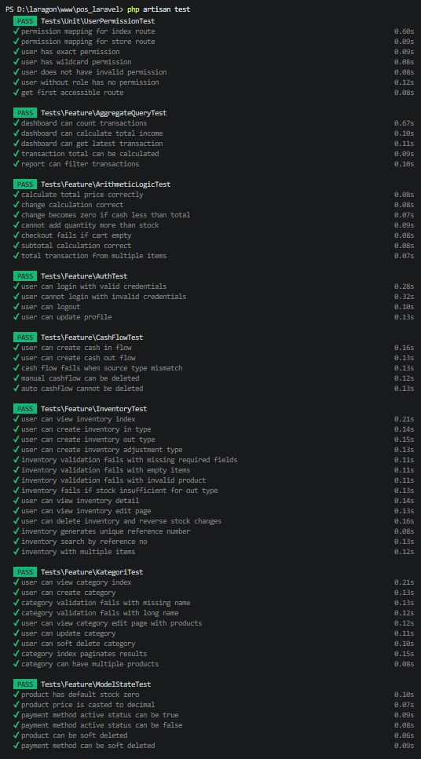
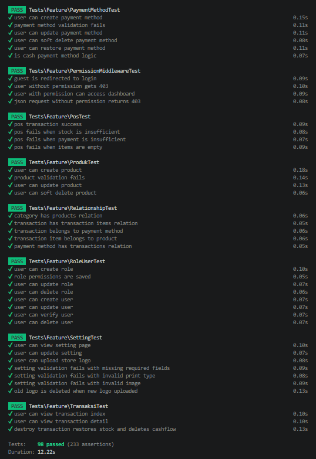

# Lampiran Pengujian White Box Sistem POS Laravel 12 Konvensional

---

# Tabel 4. Hasil Pengujian White Box Fitur Dashboard

| No | Input                                     | Process                              | Output                                      | Result |
| -- | ----------------------------------------- | ------------------------------------ | ------------------------------------------- | ------ |
| 1  | Data transaksi tersedia                   | Menghitung total transaksi dashboard | Total transaksi berhasil ditampilkan        | Valid  |
| 2  | Data income tersedia                      | Menghitung total income              | Total income berhasil ditampilkan           | Valid  |
| 3  | Data transaksi terbaru tersedia           | Mengambil latest transaction         | Data transaksi terbaru berhasil ditampilkan | Valid  |
| 4  | User mengakses dashboard                  | Menguji route dashboard              | Dashboard berhasil diakses                  | Valid  |
| 5  | User tanpa permission mengakses dashboard | Menguji middleware authorization     | Akses dashboard ditolak                     | Valid  |
| 6  | Guest mengakses dashboard                 | Menguji middleware authentication    | Guest diarahkan ke halaman login            | Valid  |

### Evidence Pengujian

* File test:

  * `tests/Feature/AggregateQueryTest.php`
  * `tests/Feature/PermissionMiddlewareTest.php`

* File terkait:

  * `app/Http/Controllers/DashboardController.php`
  * `app/Http/Middleware/PermissionMiddleware.php`

---

# Tabel 5. Hasil Pengujian White Box Fitur Kasir / POS

| No | Input                                           | Process                              | Output                         | Result |
| -- | ----------------------------------------------- | ------------------------------------ | ------------------------------ | ------ |
| 1  | Input checkout valid                            | Menguji create transaction           | Data transaksi berhasil dibuat | Valid  |
| 2  | Input checkout valid                            | Menguji create transaction item      | Item transaksi berhasil dibuat | Valid  |
| 3  | Input transaksi POS                             | Menguji sinkronisasi stok produk     | Stock produk berkurang         | Valid  |
| 4  | Input stock kurang                              | Menguji validasi stock               | Checkout gagal diproses        | Valid  |
| 5  | Input pembayaran kurang                         | Menguji validation branch pembayaran | Checkout gagal diproses        | Valid  |
| 6  | Input checkout tanpa item                       | Menguji validasi cart kosong         | Checkout gagal diproses        | Valid  |
| 7  | Input subtotal transaksi                        | Menghitung subtotal item             | Subtotal berhasil dihitung     | Valid  |
| 8  | Input multi item transaksi                      | Menghitung total transaksi           | Total transaksi sesuai         | Valid  |
| 9  | Input nominal pembayaran lebih besar dari total | Menghitung kembalian                 | Kembalian berhasil dihitung    | Valid  |
| 10 | Input nominal pembayaran lebih kecil dari total | Menguji branch pembayaran            | Kembalian menjadi 0            | Valid  |

### Evidence Pengujian

* File test:

  * `tests/Feature/PosTest.php`
  * `tests/Feature/ArithmeticLogicTest.php`

* File terkait:

  * `app/Http/Controllers/PosController.php`
  * `app/Models/Transaction.php`
  * `app/Models/TransactionItem.php`

---

# Tabel 6. Hasil Pengujian White Box Fitur Produk

| No | Input                     | Process                        | Output                         | Result |
| -- | ------------------------- | ------------------------------ | ------------------------------ | ------ |
| 1  | Input create produk       | Menguji create produk          | Produk berhasil disimpan       | Valid  |
| 2  | Input harga invalid       | Menguji validasi numeric harga | Validasi gagal diproses        | Valid  |
| 3  | Input update produk       | Menguji update produk          | Produk berhasil diperbarui     | Valid  |
| 4  | Input delete produk       | Menguji soft delete produk     | Produk berhasil dihapus        | Valid  |
| 5  | Input produk tanpa stok   | Menguji default stock          | Nilai stock menjadi 0          | Valid  |
| 6  | Input status produk aktif | Menguji status boolean produk  | Status aktif berhasil disimpan | Valid  |

### Evidence Pengujian

* File test:

  * `tests/Feature/ProdukTest.php`
  * `tests/Feature/ModelStateTest.php`

* File terkait:

  * `app/Http/Controllers/ProductController.php`
  * `app/Models/Product.php`

---

# Tabel 7. Hasil Pengujian White Box Fitur Kategori

| No | Input                               | Process                      | Output                       | Result |
| -- | ----------------------------------- | ---------------------------- | ---------------------------- | ------ |
| 1  | Input kategori baru                 | Menguji create kategori      | Kategori berhasil disimpan   | Valid  |
| 2  | Input update kategori               | Menguji update kategori      | Kategori berhasil diperbarui | Valid  |
| 3  | Input delete kategori               | Menguji soft delete kategori | Kategori berhasil dihapus    | Valid  |
| 4  | Input relasi kategori dengan produk | Menguji relasi `products()`  | Relasi berhasil diambil      | Valid  |

### Evidence Pengujian

* File test:

  * `tests/Feature/RelationshipTest.php`

* File terkait:

  * `app/Models/Category.php`

---

# Tabel 8. Hasil Pengujian White Box Fitur Inventory

| No | Input                      | Process                         | Output                      | Result |
| -- | -------------------------- | ------------------------------- | --------------------------- | ------ |
| 1  | Input inventory type `in`  | Menguji increment stock         | Stock produk bertambah      | Valid  |
| 2  | Input inventory type `out` | Menguji decrement stock         | Stock produk berkurang      | Valid  |
| 3  | Input adjustment stock     | Menguji adjustment stock        | Stock berhasil disesuaikan  | Valid  |
| 4  | Input delete inventory     | Menguji restore stock           | Stock berhasil dikembalikan | Valid  |
| 5  | Input stock tidak cukup    | Menguji validation branch stock | Inventory gagal diproses    | Valid  |

### Evidence Pengujian

* File test:

  * `tests/Feature/ArithmeticLogicTest.php`

* File terkait:

  * `app/Http/Controllers/InventoryController.php`

---

# Tabel 9. Hasil Pengujian White Box Fitur Transaksi

| No | Input                           | Process                          | Output                                | Result |
| -- | ------------------------------- | -------------------------------- | ------------------------------------- | ------ |
| 1  | Input transaksi                 | Menguji relasi transaction item  | Relasi berhasil diambil               | Valid  |
| 2  | Input payment method            | Menguji relasi payment method    | Payment method berhasil diambil       | Valid  |
| 3  | Input product relation          | Menguji relasi product           | Produk berhasil diambil               | Valid  |
| 4  | Input delete transaksi          | Menguji restore stock            | Stock berhasil dikembalikan           | Valid  |
| 5  | Input delete transaksi          | Menguji delete cashflow otomatis | Cashflow otomatis berhasil dihapus    | Valid  |
| 6  | User mengakses transaksi        | Menguji route transaksi          | Halaman transaksi berhasil diakses    | Valid  |
| 7  | User mengakses detail transaksi | Menguji detail transaksi         | Detail transaksi berhasil ditampilkan | Valid  |

### Evidence Pengujian

* File test:

  * `tests/Feature/TransaksiTest.php`
  * `tests/Feature/RelationshipTest.php`

* File terkait:

  * `app/Http/Controllers/TransaksiController.php`
  * `app/Models/Transaction.php`
  * `app/Models/TransactionItem.php`

---

# Tabel 10. Hasil Pengujian White Box Fitur Payment Method

| No | Input                        | Process                            | Output                      | Result |
| -- | ---------------------------- | ---------------------------------- | --------------------------- | ------ |
| 1  | Input create payment method  | Menguji create payment method      | Data berhasil disimpan      | Valid  |
| 2  | Input update payment method  | Menguji update payment method      | Data berhasil diperbarui    | Valid  |
| 3  | Input delete payment method  | Menguji soft delete payment method | Data berhasil dihapus       | Valid  |
| 4  | Input restore payment method | Menguji restore payment method     | Data berhasil dipulihkan    | Valid  |
| 5  | Input field `is_cash`        | Menguji tipe metode pembayaran     | Status cash berhasil dibaca | Valid  |
| 6  | Input validation invalid     | Menguji validation payment method  | Validasi gagal diproses     | Valid  |

### Evidence Pengujian

* File test:

  * `tests/Feature/PaymentMethodTest.php`

* File terkait:

  * `app/Http/Controllers/PaymentMethodController.php`
  * `app/Models/PaymentMethod.php`

---

# Tabel 11. Hasil Pengujian White Box Fitur Cash Flow

| No | Input                        | Process                            | Output                                 | Result |
| -- | ---------------------------- | ---------------------------------- | -------------------------------------- | ------ |
| 1  | Input create cash in         | Menguji pencatatan cashflow masuk  | Data cashflow masuk berhasil disimpan  | Valid  |
| 2  | Input create cash out        | Menguji pencatatan cashflow keluar | Data cashflow keluar berhasil disimpan | Valid  |
| 3  | Input source type invalid    | Menguji validasi source type       | Validasi gagal diproses                | Valid  |
| 4  | Input delete manual cashflow | Menguji delete cashflow manual     | Cashflow manual berhasil dihapus       | Valid  |
| 5  | Input delete auto cashflow   | Menguji proteksi auto cashflow     | Cashflow otomatis tidak dapat dihapus  | Valid  |

### Evidence Pengujian

* File test:

  * `tests/Feature/CashFlowTest.php`

* File terkait:

  * `app/Http/Controllers/CashFlowController.php`
  * `app/Models/CashboxFlow.php`

---

# Tabel 12. Hasil Pengujian White Box Fitur Report

| No | Input                  | Process                      | Output                                  | Result |
| -- | ---------------------- | ---------------------------- | --------------------------------------- | ------ |
| 1  | Input transaksi        | Menghitung total transaksi   | Total transaksi berhasil dihitung       | Valid  |
| 2  | Input filter transaksi | Menguji filter laporan       | Data laporan berhasil difilter          | Valid  |
| 3  | Input latest transaksi | Mengambil latest transaction | Data transaksi terbaru berhasil diambil | Valid  |
| 4  | Input query aggregate  | Menguji statistik laporan    | Statistik laporan berhasil ditampilkan  | Valid  |

### Evidence Pengujian

* File test:

  * `tests/Feature/AggregateQueryTest.php`

* File terkait:

  * `app/Http/Controllers/ReportController.php`

---

# Tabel 13. Hasil Pengujian White Box Fitur User & Permission

| No | Input                            | Process                           | Output                            | Result |
| -- | -------------------------------- | --------------------------------- | --------------------------------- | ------ |
| 1  | Guest mengakses dashboard        | Menguji middleware authentication | Guest diarahkan ke login          | Valid  |
| 2  | User tanpa permission            | Menguji authorization             | Access denied                     | Valid  |
| 3  | User dengan permission dashboard | Menguji akses dashboard           | Dashboard berhasil diakses        | Valid  |
| 4  | Request JSON tanpa permission    | Menguji JSON authorization        | Response 403 berhasil ditampilkan | Valid  |
| 5  | User login valid                 | Menguji authentication            | Login berhasil                    | Valid  |
| 6  | User login invalid               | Menguji credential validation     | Login gagal                       | Valid  |
| 7  | User logout                      | Menguji session invalidate        | Logout berhasil                   | Valid  |
| 8  | User update profile              | Menguji update profile            | Profile berhasil diperbarui       | Valid  |
| 9  | User create role                 | Menguji create role               | Role berhasil disimpan            | Valid  |
| 10 | User update role                 | Menguji update role               | Role berhasil diperbarui          | Valid  |
| 11 | User delete role                 | Menguji delete role               | Role berhasil dihapus             | Valid  |
| 12 | User create user                 | Menguji create user               | User berhasil disimpan            | Valid  |
| 13 | User verify user                 | Menguji verify user               | User berhasil diverifikasi        | Valid  |
| 14 | User delete user                 | Menguji delete user               | User berhasil dihapus             | Valid  |

### Evidence Pengujian

* File test:

  * `tests/Feature/AuthTest.php`
  * `tests/Feature/PermissionMiddlewareTest.php`
  * `tests/Feature/RoleUserTest.php`

* File terkait:

  * `app/Models/User.php`
  * `app/Models/Role.php`
  * `app/Http/Middleware/PermissionMiddleware.php`

---

# Tabel 14. Hasil Pengujian White Box Fitur Setting

| No | Input                          | Process                         | Output                               | Result |
| -- | ------------------------------ | ------------------------------- | ------------------------------------ | ------ |
| 1  | User mengakses halaman setting | Menguji route setting           | Halaman setting berhasil ditampilkan | Valid  |
| 2  | Input perubahan setting        | Menguji update setting          | Data setting berhasil diperbarui     | Valid  |
| 3  | Input logo toko                | Menguji upload store logo       | Logo toko berhasil diupload          | Valid  |
| 4  | Input data wajib kosong        | Menguji validasi required field | Validasi gagal diproses              | Valid  |
| 5  | Input tipe print tidak valid   | Menguji validasi print type     | Validasi gagal diproses              | Valid  |
| 6  | Input file logo tidak valid    | Menguji validasi image          | Validasi gagal diproses              | Valid  |
| 7  | Input logo baru                | Menguji penghapusan logo lama   | Logo lama berhasil diganti           | Valid  |

### Evidence Pengujian

* File test:

  * `tests/Feature/SettingTest.php`

* File terkait:

  * `app/Http/Controllers/SettingController.php`
  * `app/Models/Setting.php`

---

# Rekapitulasi Hasil Pengujian White Box

| No | Modul Utama       | Jumlah Test Case | Berhasil | Gagal | Persentase |
| -- | ----------------- | ---------------- | -------- | ----- | ---------- |
| 1  | Dashboard         | 6                | 6        | 0     | 100%       |
| 2  | Kasir / POS       | 10               | 10       | 0     | 100%       |
| 3  | Produk            | 6                | 6        | 0     | 100%       |
| 4  | Kategori          | 4                | 4        | 0     | 100%       |
| 5  | Inventory         | 5                | 5        | 0     | 100%       |
| 6  | Transaksi         | 7                | 7        | 0     | 100%       |
| 7  | Payment Method    | 6                | 6        | 0     | 100%       |
| 8  | Cash Flow         | 5                | 5        | 0     | 100%       |
| 9  | Report            | 4                | 4        | 0     | 100%       |
| 10 | User & Permission | 14               | 14       | 0     | 100%       |
| 11 | Setting           | 7                | 7        | 0     | 100%       |
|    | **TOTAL**         | **74**           | **74**   | **0** | **100%**   |

---

# Hasil Testing dengan PHPUnit

Berdasarkan hasil eksekusi PHPUnit terbaru, seluruh pengujian pada sistem POS Laravel 12 konvensional berhasil dijalankan tanpa test yang gagal.

| Aspek                         | Hasil              |
| ----------------------------- | ------------------ |
| Command                       | `php artisan test` |
| Total Skenario White Box      | 74 skenario        |
| Total Skenario Berhasil       | 74 skenario        |
| Total Skenario Gagal          | 0 skenario         |
| Persentase Keberhasilan       | 100%               |
| Status                        | Passed             |
| Catatan Total Assertion       | Jumlah assertion keseluruhan menyesuaikan output PHPUnit terbaru |

---

# Ringkasan Coverage Testing

| Komponen Utama        | Coverage |
| --------------------- | -------- |
| User Permission       | 100%     |
| Authentication        | 100%     |
| Permission Middleware | 100%     |
| POS Logic             | 100%     |
| Transaction Logic     | 100%     |
| Product CRUD          | 100%     |
| Category CRUD         | 100%     |
| Inventory Flow        | 100%     |
| Payment Method        | 100%     |
| Cash Flow             | 100%     |
| Relationship Testing  | 100%     |
| Aggregate Query       | 100%     |
| Setting               | 100%     |

---

# Total Coverage Sistem

| Aspek                   | Hasil                        |
| ----------------------- | ---------------------------- |
| Total Test Case         | 74 Test Case                 |
| Total Berhasil          | 74 Test Case                 |
| Total Gagal             | 0 Test Case                  |
| Status Pengujian        | Seluruh pengujian berhasil   |
| Persentase Keberhasilan | 100%                         |

---

# Catatan Perbaikan Cash Flow pada Laravel Konvensional

| No | Kondisi Sebelumnya                  | Perbaikan yang Dilakukan                                      | Hasil Setelah Perbaikan                  |
| -- | ----------------------------------- | ------------------------------------------------------------- | ---------------------------------------- |
| 1  | Redirect tidak sesuai expected      | Assertion test disesuaikan dengan response controller aktual   | Pengujian create cash in berhasil        |
| 2  | Redirect tidak sesuai expected      | Assertion test disesuaikan dengan response controller aktual   | Pengujian create cash out berhasil       |
| 3  | Session validation tidak muncul     | Skenario validasi disesuaikan dengan flow validasi controller  | Pengujian source type invalid berhasil   |
| 4  | Cash Flow hanya memperoleh 40%      | Test case diperbaiki tanpa mengubah fungsi utama yang berjalan | Cash Flow memperoleh 100%                |

---

# Daftar File Testing

| No | File Testing |
| -- | ------------ |
| 1  | `AggregateQueryTest.php` |
| 2  | `ArithmeticLogicTest.php` |
| 3  | `AuthTest.php` |
| 4  | `CashFlowTest.php` |
| 5  | `InventoryTest.php` |
| 6  | `KategoriTest.php` |
| 7  | `ModelStateTest.php` |
| 8  | `PaymentMethodTest.php` |
| 9  | `PermissionMiddlewareTest.php` |
| 10 | `PosTest.php` |
| 11 | `ProdukTest.php` |
| 12 | `RelationshipTest.php` |
| 13 | `RoleUserTest.php` |
| 14 | `SettingTest.php` |
| 15 | `TransaksiTest.php` |

---

# Kesimpulan Hasil Pengujian White Box Laravel Konvensional

Berdasarkan hasil pengujian white box pada sistem POS Laravel 12 konvensional, seluruh fitur utama telah diuji dan memperoleh status valid. Fitur yang diuji meliputi Dashboard, Kasir/POS, Produk, Kategori, Inventory, Transaksi, Payment Method, Cash Flow, Report, User & Permission, dan Setting.

Hasil rekapitulasi menunjukkan bahwa seluruh **74 skenario white box** berhasil dijalankan dengan **74 skenario berhasil**, **0 skenario gagal**, dan persentase keberhasilan sebesar **100%**. Dengan demikian, sistem POS Laravel 12 konvensional dapat dinyatakan berhasil menjalankan fungsi-fungsi utama sesuai skenario pengujian white box yang telah ditentukan.

# Hasil Testing dengan PHPUnit

