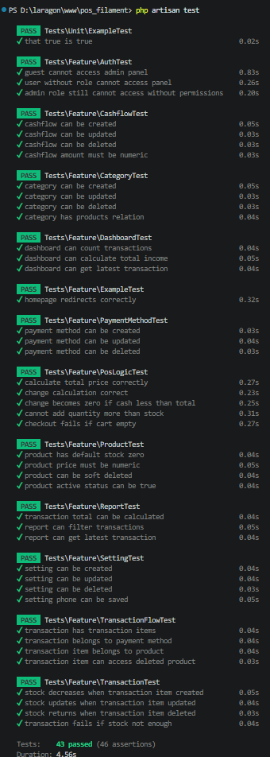

# Lampiran Pengujian White Box Sistem POS Filament

---

# Tabel 4. Hasil Pengujian White Box Fitur Dashboard

| No | Input | Process | Output | Result |
|---|---|---|---|---|
| 1 | Data transaksi tersedia | Menghitung total transaksi pada widget dashboard | Total transaksi berhasil ditampilkan | Valid |
| 2 | Data pemasukan tersedia | Menghitung total income | Total income tampil sesuai data | Valid |
| 3 | Data transaksi terbaru tersedia | Mengambil latest transaction | Data transaksi terbaru berhasil ditampilkan | Valid |
| 4 | User mengakses dashboard | Menguji route dashboard dan permission akses | Dashboard berhasil diakses | Valid |
| 5 | User tanpa permission mengakses dashboard | Menguji middleware authorization | Akses dashboard ditolak | Valid |
| 6 | Guest mengakses dashboard | Menguji middleware autentikasi | Guest diarahkan ke halaman login | Valid |

### Evidence Pengujian
- File test: `tests/Feature/DashboardTest.php`
- File test: `tests/Feature/AccessTest.php`
- File terkait:
  - `app/Filament/Pages/Dashboard.php`
  - `app/Filament/Widgets/*`

---

# Tabel 5. Hasil Pengujian White Box Fitur Kasir / POS

| No | Input | Process | Output | Result |
|---|---|---|---|---|
| 1 | Input produk ke cart | Menguji fungsi `addToOrder()` | Produk berhasil masuk cart | Valid |
| 2 | Input produk yang sama dua kali | Menguji merge quantity item | Quantity bertambah otomatis | Valid |
| 3 | Input increase quantity | Menguji fungsi `increaseQuantity()` | Quantity bertambah | Valid |
| 4 | Input decrease quantity | Menguji fungsi `decreaseQuantity()` | Quantity berkurang | Valid |
| 5 | Quantity = 1 lalu decrease | Menguji auto remove item | Item otomatis terhapus dari cart | Valid |
| 6 | Input transaksi item | Menghitung total transaksi menggunakan `calculateTotal()` | Total transaksi sesuai | Valid |
| 7 | Input nominal pembayaran lebih besar dari total | Menghitung kembalian menggunakan `calculateChange()` | Kembalian berhasil dihitung | Valid |
| 8 | Input nominal pembayaran lebih kecil dari total | Menguji validation branch pembayaran | Nilai kembalian menjadi 0 | Valid |
| 9 | Input quantity melebihi stok | Menguji validasi stok produk | Quantity tidak melebihi stok | Valid |
| 10 | Input checkout tanpa item transaksi | Menguji validasi cart kosong | Checkout gagal diproses | Valid |
| 11 | Input checkout valid | Menguji create transaction | Data transaksi berhasil dibuat | Valid |
| 12 | Input checkout valid | Menguji create transaction item | Item transaksi berhasil dibuat | Valid |
| 13 | Input checkout transaksi | Menguji sinkronisasi stok produk | Stock produk otomatis berkurang | Valid |
| 14 | Input reset order | Menguji fungsi `resetOrder()` | Cart berhasil direset | Valid |

### Evidence Pengujian
- File test:
  - `tests/Feature/PosLogicTest.php`
  - `tests/Feature/PosAdvancedTest.php`
  - `tests/Feature/PosCheckoutTest.php`
- File terkait:
  - `app/Livewire/Pos.php`
  - `resources/views/livewire/pos.blade.php`

---

# Tabel 6. Hasil Pengujian White Box Fitur Produk

| No | Input | Process | Output | Result |
|---|---|---|---|---|
| 1 | Input produk tanpa stok | Menguji default stock produk | Nilai stock menjadi 0 | Valid |
| 2 | Input harga produk berupa string | Menguji validasi numeric harga produk | Validasi gagal diproses | Valid |
| 3 | Input delete produk | Menguji soft delete produk | Produk berhasil dihapus | Valid |
| 4 | Input status produk aktif | Menguji field status produk | Status aktif berhasil disimpan | Valid |
| 5 | User admin mengakses halaman produk | Menguji permission akses produk | Halaman produk berhasil diakses | Valid |
| 6 | User tanpa permission mengakses produk | Menguji middleware permission produk | Akses produk ditolak | Valid |
| 7 | Guest mengakses halaman produk | Menguji middleware autentikasi | Guest diarahkan ke login | Valid |

### Evidence Pengujian
- File test:
  - `tests/Feature/ProductTest.php`
  - `tests/Feature/ProductAccessTest.php`
- File terkait:
  - `app/Filament/Resources/ProductResource.php`
  - `app/Models/Product.php`

---

# Tabel 7. Hasil Pengujian White Box Fitur Kategori

| No | Input | Process | Output | Result |
|---|---|---|---|---|
| 1 | Input nama kategori baru | Menguji create kategori | Data kategori berhasil disimpan | Valid |
| 2 | Input perubahan nama kategori | Menguji update kategori | Data kategori berhasil diperbarui | Valid |
| 3 | Input delete kategori | Menguji soft delete kategori | Data kategori berhasil dihapus | Valid |
| 4 | Input relasi kategori dengan produk | Menguji relasi `products()` | Relasi produk berhasil diambil | Valid |

### Evidence Pengujian
- File test:
  - `tests/Feature/CategoryTest.php`
- File terkait:
  - `app/Filament/Resources/CategoryResource.php`
  - `app/Models/Category.php`

---

# Tabel 8. Hasil Pengujian White Box Fitur Inventory

| No | Input | Process | Output | Result |
|---|---|---|---|---|
| 1 | Input inventory type `in` | Menguji observer increment stock | Stock produk bertambah otomatis | Valid |
| 2 | Input inventory type `out` | Menguji observer decrement stock | Stock produk berkurang otomatis | Valid |
| 3 | Input inventory type `adjustment` | Menguji observer adjustment stock | Stock produk berhasil disesuaikan | Valid |
| 4 | Input delete inventory item | Menguji restore stock observer | Stock berhasil dikembalikan | Valid |
| 5 | Input create inventory | Menguji generate reference number | Nomor referensi inventory berhasil dibuat | Valid |

### Evidence Pengujian
- File test:
  - `tests/Feature/InventoryObserverTest.php`
  - `tests/Feature/TransactionTest.php`
- File terkait:
  - `app/Observers/InventoryObserver.php`
  - `app/Observers/InventoryItemObserver.php`

---

# Tabel 9. Hasil Pengujian White Box Fitur Transaksi

| No | Input | Process | Output | Result |
|---|---|---|---|---|
| 1 | Input transaksi dan item transaksi | Menguji relasi transaksi | Item transaksi berhasil terhubung | Valid |
| 2 | Input payment method transaksi | Menguji relasi payment method | Payment method berhasil diambil | Valid |
| 3 | Input produk yang telah dihapus | Menguji relasi `productWithTrashed()` | Produk tetap dapat diakses | Valid |
| 4 | Input create transaksi | Menguji generate nomor transaksi | Nomor transaksi berhasil dibuat | Valid |
| 5 | Input create transaction item | Menguji observer pengurangan stock | Stock berhasil berkurang | Valid |
| 6 | Input update transaction item | Menguji observer update stock | Stock berhasil diperbarui | Valid |
| 7 | Input delete transaction item | Menguji restore stock observer | Stock berhasil dikembalikan | Valid |
| 8 | Input quantity melebihi stock | Menguji validation branch stock | Transaksi gagal diproses | Valid |

### Evidence Pengujian
- File test:
  - `tests/Feature/TransactionFlowTest.php`
  - `tests/Feature/TransactionTest.php`
- File terkait:
  - `app/Models/Transaction.php`
  - `app/Models/TransactionItem.php`
  - `app/Observers/TransactionItemObserver.php`

---

# Tabel 10. Hasil Pengujian White Box Fitur Payment Method

| No | Input | Process | Output | Result |
|---|---|---|---|---|
| 1 | Input metode pembayaran baru | Menguji create payment method | Data berhasil disimpan | Valid |
| 2 | Input update payment method | Menguji update payment method | Data berhasil diperbarui | Valid |
| 3 | Input delete payment method | Menguji delete payment method | Data berhasil dihapus | Valid |
| 4 | Input field `is_cash` | Menguji tipe metode pembayaran | Status cash berhasil dibaca | Valid |

### Evidence Pengujian
- File test:
  - `tests/Feature/PaymentMethodTest.php`
- File terkait:
  - `app/Models/PaymentMethod.php`
  - `app/Filament/Resources/PaymentMethodResource.php`

---

# Tabel 11. Hasil Pengujian White Box Fitur CashFlow

| No | Input | Process | Output | Result |
|---|---|---|---|---|
| 1 | Input data cashflow | Menguji create cashflow | Data cashflow berhasil disimpan | Valid |
| 2 | Input update cashflow | Menguji update cashflow | Data cashflow berhasil diperbarui | Valid |
| 3 | Input delete cashflow | Menguji delete cashflow | Data cashflow berhasil dihapus | Valid |
| 4 | Input nominal non numeric | Menguji validasi amount | Validasi gagal diproses | Valid |

### Evidence Pengujian
- File test:
  - `tests/Feature/CashflowTest.php`
- File terkait:
  - `app/Models/CashFlow.php`
  - `app/Filament/Resources/CashFlowResource.php`

---

# Tabel 12. Hasil Pengujian White Box Fitur Report

| No | Input | Process | Output | Result |
|---|---|---|---|---|
| 1 | Input data transaksi | Menghitung total transaksi laporan | Total transaksi berhasil dihitung | Valid |
| 2 | Input filter tanggal transaksi | Menguji filter laporan | Data laporan berhasil difilter | Valid |
| 3 | Input transaksi terbaru | Mengambil latest transaction | Data transaksi terbaru berhasil diambil | Valid |
| 4 | Input query agregasi | Menguji query statistik laporan | Statistik laporan berhasil ditampilkan | Valid |

### Evidence Pengujian
- File test:
  - `tests/Feature/ReportTest.php`
- File terkait:
  - `app/Filament/Resources/ReportResource.php`

---

# Tabel 13. Hasil Pengujian White Box Fitur User & Permission

| No | Input | Process | Output | Result |
|---|---|---|---|---|
| 1 | User mengakses panel tanpa login | Menguji middleware autentikasi | User diarahkan ke halaman login | Valid |
| 2 | User login dengan role admin | Menguji akses panel menggunakan `canAccessPanel()` | User berhasil masuk dashboard | Valid |
| 3 | User login tanpa role | Menguji validasi role | Akses panel ditolak | Valid |
| 4 | User dengan role admin tanpa permission | Menguji permission Shield | Akses panel ditolak | Valid |
| 5 | User dengan permission dashboard | Menguji akses dashboard | Dashboard berhasil diakses | Valid |
| 6 | User tanpa permission dashboard | Menguji authorization dashboard | Dashboard ditolak | Valid |
| 7 | User admin mengakses produk | Menguji permission produk | Halaman produk berhasil diakses | Valid |
| 8 | User cashier mengakses produk | Menguji unauthorized access | Akses produk ditolak | Valid |

### Evidence Pengujian
- File test:
  - `tests/Feature/AccessTest.php`
  - `tests/Feature/AuthTest.php`
  - `tests/Feature/ProductAccessTest.php`
- File terkait:
  - `app/Models/User.php`
  - `config/filament-shield.php`

---

# Tabel 14. Hasil Pengujian White Box Fitur Setting

| No | Input | Process | Output | Result |
|---|---|---|---|---|
| 1 | Input nama toko | Menguji save setting | Nama toko berhasil disimpan | Valid |
| 2 | Input nomor telepon | Menguji field phone | Nomor telepon berhasil disimpan | Valid |
| 3 | Input logo toko | Menguji upload logo | Logo berhasil diupload | Valid |
| 4 | Input konfigurasi printer | Menguji setting printer | Konfigurasi printer berhasil disimpan | Valid |

### Evidence Pengujian
- File test:
  - `tests/Feature/SettingTest.php`
- File terkait:
  - `app/Models/Setting.php`
  - `app/Filament/Resources/SettingResource.php`

---

# Tabel 15. Hasil Pengujian White Box Fitur Receipt / Invoice

| No | Input | Process | Output | Result |
|---|---|---|---|---|
| 1 | Input ID transaksi valid | Menguji route receipt | Receipt berhasil ditampilkan | Valid |
| 2 | Input download receipt | Menguji download invoice | Invoice berhasil diunduh | Valid |
| 3 | Input relasi transaction item | Menguji data item receipt | Data item berhasil ditampilkan | Valid |
| 4 | Input ID transaksi invalid | Menguji validasi transaksi | Response 404 berhasil ditampilkan | Valid |
| 5 | Input download receipt invalid | Menguji invalid download route | Response 404 berhasil ditampilkan | Valid |

### Evidence Pengujian
- File test:
  - `tests/Feature/ReceiptControllerTest.php`
- File terkait:
  - `app/Http/Controllers/ReceiptController.php`

---

# Rekapitulasi Hasil Pengujian White Box

| No | Modul Utama | Jumlah Test Case | Berhasil | Gagal | Persentase |
|---|---|---|---|---|---|
| 1 | Dashboard | 6 | 6 | 0 | 100% |
| 2 | Kasir / POS | 14 | 14 | 0 | 100% |
| 3 | Produk | 7 | 7 | 0 | 100% |
| 4 | Kategori | 4 | 4 | 0 | 100% |
| 5 | Inventory | 5 | 5 | 0 | 100% |
| 6 | Transaksi | 8 | 8 | 0 | 100% |
| 7 | Payment Method | 4 | 4 | 0 | 100% |
| 8 | CashFlow | 4 | 4 | 0 | 100% |
| 9 | Report | 4 | 4 | 0 | 100% |
| 10 | User & Permission | 8 | 8 | 0 | 100% |
| 11 | Setting | 4 | 4 | 0 | 100% |
| 12 | Receipt / Invoice | 5 | 5 | 0 | 100% |
|  | **TOTAL** | **73** | **73** | **0** | **100%** |

---

# Hasil Testing dengan PHPUnit

## Ringkasan Coverage Testing

| Komponen Utama | Coverage |
|---|---|
| Livewire POS | 71.2% |
| Product Resource | 56.7% |
| Receipt Controller | 100% |
| Transaction Helper | 100% |
| Transaction Item Observer | 100% |
| Dashboard | 100% |
| Scanner Modal Component | 66.7% |

## Total Coverage Sistem

| Aspek | Hasil |
|---|---|
| Total Test | 72 Test |
| Total Assertion | 80 Assertion |
| Total Coverage | 21.9% |
| Status Pengujian | Seluruh pengujian berhasil dijalankan |